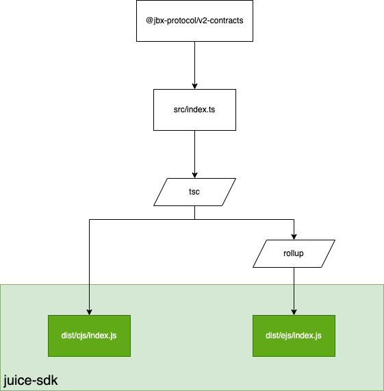

# juice-sdk build process

juice-sdk is built to support commonjs (cjs) and ESModule (esm) environments.

## Compile the SDK

Run `npm run build` to compile the SDK. This command executes the following steps:

1. Builds the cjs library by running `tsc` using `tsconfig.node.json`.
1. Builds the esm library by running `tsc` using `tsconfig.browser.json`.
1. Recompiles the esm library using `rollup` to include the `@jbx-protocol/contracts-v2` modules in the bundle.
   - We do this so both Webpack and Rollup can treeshake the ABIs, removing parts of the ABIs that aren't used by the client.

The juice-sdk build pipeline, visualized.

## Publish a new version

1. Run `npm run build` to build the SDK.
2. Bump the npm version in accordance with Semver.
3. Publish to npm using `npm publish`.
